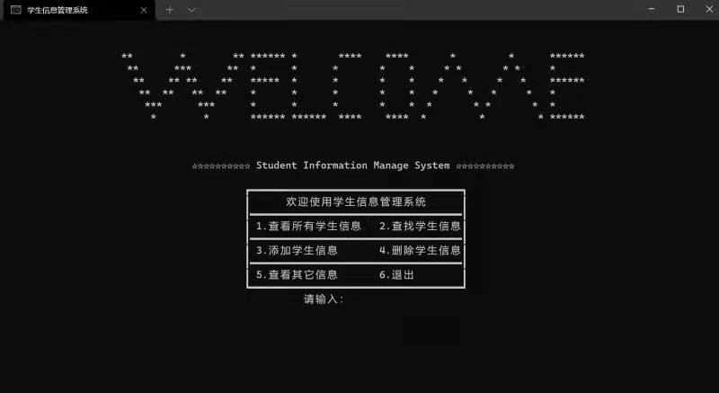

# 学生信息管理系统

背景介绍：

C++ 大作业，我觉得界面实现的挺有意思的，就搭个 repo 保存一下。

环境配置：
+ Windows 11
+ IDE: Visual Studio 2022
+ 数据库: MySQL

数据库字段：

|  id  |  name  |  sex  |  score  |

|(int)|(string)|(string)|(double)|

运行截图：

